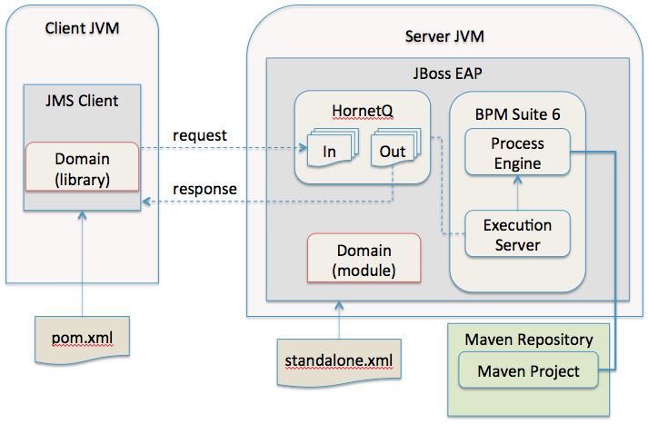

:data-uri:
:toc2:
:labs: link:http://people.redhat.com/althomas/eap6/eap6CourseMaterial.html[Course Materials]

image::images/rhheader.png[width=900]

:numbered!:
[abstract]
== JMS to BPM Suite 6 Process Engine
This reference architecture provides a detailed example of how to configure and use the JMS interface to the BPM Suite 6 process engine.
Along with the explanation, a project is provided with instructions on how to execute the example.

:numbered:

== The Use Case
Message queues are a vital component to many application architectures.  Any time two independent systems are required to communicate, there is the high potential
that they will differ in processing speed and availbility.  This leads to the need for asynchronous communication to decouple the sender from the receiver.  This decoupling
has numerous benefits to the overall system including:

. *Decoupling* - The two systems can be extended and modified independently as long as they adhere to the same interface requirements
. *Redundancy* - The message may be held safely in the queue until the receiver is able to process the message without errors.
. *Scalability* - 
. *Resiliency* -
. *Delivery Guarantees* - 
. *Ordering Guarantees* - 
. *Buffering* - 

== BPM Suite 6 integration via JMS
The following architecture diagram illustrates the components discussed below.

.JMS to BPM Suite 6 Architecture Diagram

=== JMS Service Work Item Handler
The purpose of this custom Work Item Handler is to provide a flexible JMS Service for sending messages via JMS to a JMS Queue or Topic.
The following are setup details:

==== Adding the WIH to JBoss EAP 6
The work item handler comes in a jar file that is deployed to JBoss EAP 6 as a static module in JBoss Modules.  To do this do the following steps.

. Shutdown JBoss EAP 6
. compile the project to build the class file
.. navigate to the JMSWIH project file
.. execute `mvn clean package`
. The jar file is now located in the `target` directory of the project.
. Add additional folders to create the following directory: `$JBOSS_HOME/modules/system/layers/bpms/org/gpe/service/jms/main`
. Copy the jar file from the target directory to `$JBOSS_HOME/modules/system/layers/bpms/org/gpe/service/jms/main
. Copy the `module.xml` file from the `JMSWIH\savemodule` folder to the same target directory
. Open the following file in a editor: `$JBOSS_HOME/standalone/deployments/business-central.war/WEB-INF/jboss-deployment-structure.xml`
. Add the following as a new entry in the list of dependencies: `<module name="org.gpe.service.jms"/>`
. Save the file and restart the server

==== Setup the Queue
The service will write messages to a Queue. You can use the `ConfigureJMS.cli` CLI script in the `cliScript` folder to setup the queue.  Execute
the script with the following command:

.From your $JBOSS_HOME folder
----------
./bin/jboss-cli.sh --file=/<your path>/insurancepolicy/cliScript/ConfigureJMS.cli
---------- 

You can use the other script to check the status of the queue.

==== Adding the registration for the WIH
To register the Work Item Handler it must be registered with the process engine.  To do this we and an entry into kmodule.xml as follows

. Within Business-central naviage to the `kmodule.xml` file. (under resources/META-INF)
. add the following:

----------
<kmodule xmlns="http://jboss.org/kie/6.0.0/kmodule" xmlns:xsi="http://www.w3.org/2001/XMLSchema-instance">
  <kbase name="policyQuoteKBase" default="true" eventProcessingMode="stream" equalsBehavior="equality" declarativeAgenda="disabled" scope="javax.enterprise.context.ApplicationScoped" packages="*">
    <ksession name="policyQuoteKSession" type="stateful" default="true" clockType="realtime" scope="javax.enterprise.context.ApplicationScoped">
      <workItemHandlers>
        <workItemHandler type="new org.gpe.service.jms.JMSWorkItemHandler()" name="JMSServiceTask"/>
      </workItemHandlers>
    </ksession>
  </kbase>
</kmodule>
----------

. Be sure to `save` the change.
. It seems to be necessary to restart the server after making a change to the kmodule.xml file.  Do this `before` doing a build and deploy.

==== Testing the service
Three artifacts have been added to aid in testing the service.

- *TestJMSServiceTask* is a simple business process that uses the JMS service.
- *startTestJMSServiceBP* is a rule that simply starts the business process.
- *StartTheJMSServiceTest* is a test scenario that can be used to start to kick off the rule.
 

== Performance Testing
In the following we measure the system impact when changes are made to configuration paramenters on the JMS interface between BPM Suite 6 and 
JMS client applications.  Other relevant BPM Suite 6 configuration options are also taken into consideration.
* Queue sizeing
* message listener configuration
* durable vs non-durable queues
* Single process knowledge session vs process per request

.Tiger block image
image::images/tiger.png[Tiger image]
