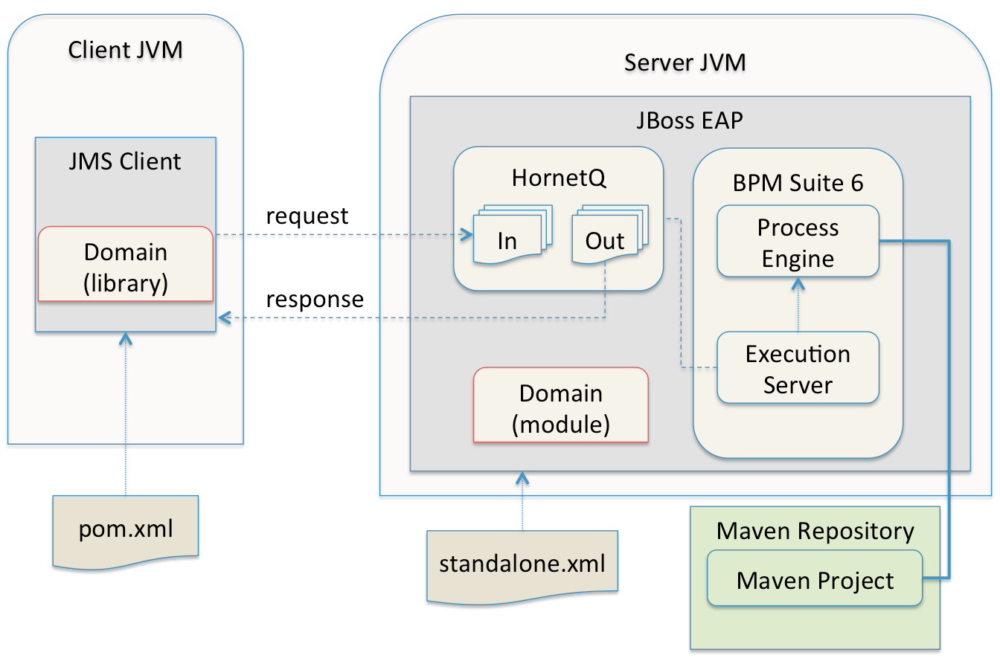

:data-uri:
:toc2:
:rpms: link:https://github.com/jboss-gpe-ose/jboss_bpm_soa_rpmbuild[RPMs]
:cart: link:https://github.com/jboss-gpe-ose/openshift-origin-cartridge-bpms-full[Red Hat GPE's BPM Suite 6 cartridge]
:bpmproduct: link:https://access.redhat.com/site/documentation/en-US/Red_Hat_JBoss_BPM_Suite/[Red Hat's BPM Suite 6 product]
:osetools: link:https://access.redhat.com/site/documentation/en-US/OpenShift_Enterprise/2/html-single/Client_Tools_Installation_Guide/index.html[Openshift Enterprise client tools]

image::images/rhheader.png[width=900]

:numbered!:
[abstract]
== BPM Suite 6 Execution Server:  JMS API
This reference architecture provides a detailed example of how to configure and use the JMS API of the BPM Suite 6 Execution Server.
Along with the explanation, a project is provided with instructions on how to execute the example.

This reference architecture provides two major use cases related to JMS and BPM Suite 6 and one utility use case.  The two major use case are the following:

. `JMS Transport` - Starting a BPM Suite 6 process via a JMS transport.  The use case includes passing parameters to the BPM Suite 6 process and recieving a confirmation response from BPM Suite 6.
. `JMS Service Task` - Sending a JMS message from a BPM Suite 6 process.

The utility use case uses JMeter to perform load tests against the JMS transport.  The term `utility use case` is used because it is not functionality that to be used in an application, yet it provides vital informaiton for building applications.  

The following discusses when it is necessary to use these use cases, how the examples work, and how to configure the examples to run on your own system.

TIP: Within the context of the discussion, `TIP` sections like this will be used to highlight best practices.

:numbered:

== BPM Suite 6 integration via JMS
Message queues are a vital component to many application architectures.  Any time two independent systems are required to communicate, there is the high potential
that they will differ in processing speed and availbility.  This leads to the need for asynchronous communication to decouple the sender from the receiver.  This decoupling
has numerous benefits to the overall system including:

. *Decoupling* - The two systems can be extended and modified independently as long as they adhere to the same interface requirements
. *Redundancy* - The message may be held safely in the queue until the receiver is able to process the message without errors.
. *Scalability* - 
. *Resiliency* -
. *Delivery Guarantees* - 
. *Ordering Guarantees* - 
. *Buffering* - 

The JMS API can be used in two directions with respect to BPM Suite 6. First a JMS message may be sent to the BPM Suite 6 server to start a process.  Second
a BPM Suite 6 process may need to send a JMS message to a topic or queue.  Both of these cases are are addressed in this reference architecture.

== The JMS Transport
The JMS transport example sends a POJO java object from a client application to a BPM Suite 6 process.  The BPM Suite 6 process is started upon retrieving the message from the JMS queue.  For this example, a `client application` refers to process running outside of the JVM for the server.  See the following diagram for an illustration of this use case.

The following architecture diagram illustrates the components discussed below.

.JMS Transport Architecture Diagram

Each component in the diagram plays a role in the execution of the use case and is discussed roughly in the order of execution of the use case.

=== Client JVM

=== JMS Client

=== pom.xml

=== Domain

=== HornetQ

=== Maven Repository

=== Execution Server

=== BPM Suite 6 Process Engine

== Pre-Requisites
The remainder of this documentation provides instructions for installation, configuration and execution of this reference archicture.  
The following is a list of pre-requisites:

. {osetools}
. Openshift Enterprise 2.* environment that has been installed with {rpms} needed to support {cart}.  Contact the Red Hat GPE team for more details.
. medium-sized Openshift Enterprise gear provisioned with {cart} and mysql-5.
. ssh client
. maven 3.0.5 (or greater)
. git client
. familiarity with {bpmproduct}

As is evidenced by these pre-requisites, the assumed BPM Suite 6 runtime environment for this reference architecture 
documentation is an Openshift Enterprise gear.  However, BPM Suite 6 can be installed in a non-PaaS local environment.  
Thus it could be possible to execute this reference archicture in a non-PaaS local environment as well.

== JMS Transport configuration and execution
To setup this use case we will take the following major steps:

.Setup Summary
. Domain class installation
. Configure queues for BPM Sutie 6 messages
. Configure port forwarding for the JMS Broker
. Configure port forwarding for the JBoss EAP console
. Add the target business process to the server
. Configure the JMS Client
. Execute the use case

The details of these steps are provided below.

=== Domain class installation
In the top level folder for this reference archtiecture, there is a folder with the name `domain`.  This folder contains a maven project for building and packageing
the jar files that will contain the domain classes for this reference architecture.  If you examine the domain classes, you will find that they are configured to
enable serialization via Java Architecture for XML Binding (JAXB).  There are steps required by the client to enable the server to process the JAXB annotated objects.
Those details are discussed in the <<Configure_the_JMS_Client,client configuration>> section. 

The following steps are directions for building the jar file and installing the jar as a static module on your EAP server running in OpenShift. Finally, we will also
configure the `business-central.war` application in BPM Suite 6 to have a dependency on the static module, making the domain class available to use in your business processes.

From your local cloned copy of this project do the following:

. create the jar for the domain classes
.. cd domain
.. mvn clean package
.. cd ..
. copy the directories and files required to create a static module on the JBoss EAP server
.. local:
... cp -r domain/conf/org $JBOSS_HOME/modules/system/layers/base
... cp domain/target/domain-1.0.jar $JBOSS_HOME/modules/system/layers/base/org/acme/insurance/main/
.. remote:
... ssh <ssh_url_to_your_openshift_environment> \'mkdir -p app-root/data/appModules'
... scp -r domain/conf/org <your_id_on_openshift>@<your_openshift_host>:~/app-root/data/appModules/
... scp domain/target/domain-1.0.jar <your_id_on_openshift>@<your_openshift_host>:~/app-root/data/appModules/org/acme/insurance/main/
. Add and explicit dependency for business-central.war on the static module for the domain module
.. ssh <ssh_url_to_your_openshift_environment>
.. In a text editor, open the following file `~/bpms/standalone/deployments/business-central.war/WEB-INF/jboss-deployment-structure.xml`
.. Add the following to the list of dependecies: `<module name="org.acme.insurce" export="true" services="import" meta-inf="import"/>`
.. Save the changes to the file
. Restart your OpenShift BPM Suite 6 instance
.. Determine if the JBoss process is already running by entering: `ps -aef | grep java`
... If the JBoss process is not running, then execute: `ctl_app start`
... If the JBoss process is running, then execute: `ctl_app restart` and select option `1` at the following prompt:

----------
Cart to restart?
1. bpms-6.0
2. mysql-5.1
----------

When the cursor returns, typically the server has not completely started at that moment.  Use the following command to view the log file and confirm
when the server startup has completed:

.View the server log
----------
tail -f ~/bpms/standalone/log/server.log
----------

Wait for a log entry that includes the following:

.Confirmation of server startup
----------
Deployed "business-central.war" (runtime-name : "business-central.war")
----------

=== Configure queues for BPM Sutie 6 messages
When the business-central Workbench is deployed, it automatically creates 3 queues:

* jms/queue/KIE.SESSION
* jms/queue/KIE.TASK
* jms/queue/KIE.RESPONSE

The `KIE.SESSION` and `KIE.TASK` queues should be used to send command request messages to the JMS API. Command response
messages will be then placed on the `KIE.RESPONSE`. Command request messages that involve starting and managing business processes
should be sent to the `KIE.SESSION` and command request messages that involve managing human tasks, should be sent to the
`KIE.TASK` queue.

Although there are 2 different input queues, `KIE.SESSION` and `KIE.TASK`, this is only in order to provide multiple
input queues so as to optimize processing: command request messages will be processed in the same manner regardless of which queue they're sent to.
However, in some cases, users may send many more requests involving human tasks than requests involving business processes, but then not want the
processing of business process-related request messages to be delayed by the human task messages. By sending the appropriate command request
messages to the appropriate queues, this problem can be avoided.

The BPM Suite 6 Execution Server uses a Message Driven Bean (MDB) to process messages on the from the queues.  To change the any of the above queues
to an alternative queue, change the JDNI name in the MDB configuration to point to the desired queue.  The JNDI configuration for the MDB can be found
at the following location:

.ejb-jar.xml file for the MDB
----------
$JBOSS_HOME/standalone/deployments/business-central.war/WEB-INF/ejb-jar.xml
----------

The three default queues are created in HornetQ.  The following file is used to configure the three queue in the EAP server:

.HornetQ Queue configurations for BPM Suite 6
----------
business-central.war/WEB-INF/bpms-jms.xml
----------

For this reference architecture, the default queues will be used, so no steps are required to setup the queues.  However, HornetQ uses port `5445` which is
not an open port on the OpenShift server.  Therefore port forwarding is configured in the next step to resolve this issue.

=== Configure port forwarding for the JMS Broker
The ssh utility allows you to forward a port through the encrypted connection it establishes.  This setup is also referred to as `ssh tunneling`.
Since port 5445 is not open on the OpenShift server, port forwarding will be configured to securely access these services.

Execute the following command from your command window on your local computer to configure and launch a port forwarding process for access to HornetQ:

.Port Forwarding command for HornetQ access
----------
ssh -N -L localhost:5445:<ip_address_to_your_openshift_server>:5445 <ssh_url_to_your_openshift_environment>
----------

While the port forwarding process is running, the HornetQ broker can be access on the local computer at `localhost:5445`.
Use `Ctrl+c` to kill the process to turn off port forwarding.

=== Configure port forwarding for the JBoss EAP console
For this reference architecture, access to the EAP console is not strickly required.  However, it may be desireable to access the console to configure alternative
settings, for JMS Queues for example.  The EAP console runs on port 9990.  Again, this port is not open on the OpenShift server so port forwarding can be used to provide access.

Use the following command to setup port forarding for the EAP console:

.Port Forwarding command for JBoss EAP access
----------
ssh -N -L localhost:9990:<ip_address_to_your_openshift_server>:9990 <ssh_url_to_your_openshift_environment>
----------

While the port forwarding process is running, the EAP console may be accessed on the browser at the address `http://localhost:9990/console`

=== Add the target business process to the server
This reference architecture uses a simple buiness process that prints a conformation message to confirm that the process was started at that the parameter sent via the JMS message
is available to the business process as a process variable.

To setup the business process, setup the repository on BPM Suite 6, make a local clone, add the project to your clone, then use a git push to update the remote BPM Suite 6 server.
The following provides the deatils for these steps.

Use the following steps to setup the business process for this reference architecture:

. Create an *Organization, Repository and Project* in your BPM Suite 6 server
.. Select `Authoring` -> `Administration`
.. Select `Organizational Units` -> `Manage Organizational Units`
.. Under `Organizational Unit Manager`, select the `Add` button
.. Enter a name and owner and select `Ok`
.. Select `Repostories` -> `New Repository`
.. Add `jmsTransportRA` for the name of your repository and select the organization unit previously made, then select `Create`
.. Select `Authoring` -> `Project Authoring`
.. Make sure the `jmsTransportRA` repository is viewable in the `Project Explorer`
.. Select `New Item` -> `Project`
.. Add a project name of `jmsTransportProj`
.. Select `Ok`
.. For organization add `com.gpe.jmsTransport`
.. Select `Finish`

[start=2]
. Open a command window to a directory where you will add the cloned version of the BPM Suite 6 project.

Since the port for the *git* protocol is not open on the OpenShift server, the clone operation will use the *ssh* protocol instead.

[start=3]
. Use a comand, structured like the following to make a local clone of your remote repository on the BPM Suite 6 server:

----------
git clone ssh://<your.openshift.ssh.url>/~/app-root/data/bpmsGit/.niogit/jmsTransportRA.git
----------

[start=4]
. From the root directory of this reference architecture, copy the contents of `processTier/src` to the directory created in the previous step
.. `cp -r processTier/src <path_to_your_clone>/jmsTransport/jmsTransportProj/.`
. Next, commit the changes and push the changes to the remote BPM Suite 6 instance
.. `git add jmsTransportProj/src`
.. `git commit -m 'Added the project with the business processes for the reference architecture'`
.. `git pull`
.. `git push`

[[Configure_the_JMS_Client]]
=== Configure the JMS Client

=== Execute the use case

== JMS Service Task
The purpose of this custom Work Item Handler is to provide a flexible JMS Service for sending messages via JMS to a JMS Queue or Topic.
The following are setup details:

The following architecture diagram illustrates the components discussed below.

.JMS Service Task Architecture Diagram
image::images/JMS_WIH_arch_diagram.png[width="60%"]

Each component in the diagram plays a role in the execution of the use case and is discussed roughly in the order of execution of the use case.

=== Maven Repository

=== BPM Suite 6 Process Engine

=== JMS Service WIH

=== Domain

=== JMS Broker

== JMS Service Task use and configuration

=== Adding the WIH to JBoss EAP 6
The work item handler comes in a jar file that is deployed to JBoss EAP 6 as a static module in JBoss Modules.  To do this do the following steps.

. Shutdown JBoss EAP 6
. compile the project to build the class file
.. navigate to the JMSWIH project file
.. execute `mvn clean package`
. The jar file is now located in the `target` directory of the project.
. Add additional folders to create the following directory: `$JBOSS_HOME/modules/system/layers/bpms/org/gpe/service/jms/main`
. Copy the jar file from the target directory to `$JBOSS_HOME/modules/system/layers/bpms/org/gpe/service/jms/main
. Copy the `module.xml` file from the `JMSWIH\savemodule` folder to the same target directory
. Open the following file in a editor: `$JBOSS_HOME/standalone/deployments/business-central.war/WEB-INF/jboss-deployment-structure.xml`
. Add the following as a new entry in the list of dependencies: `<module name="org.gpe.service.jms"/>`
. Save the file and restart the server

=== Setup the Queue
The service will write messages to a Queue. You can use the `ConfigureJMS.cli` CLI script in the `cliScript` folder to setup the queue.  Execute
the script with the following command:

.From your $JBOSS_HOME folder
----------
./bin/jboss-cli.sh --file=/<your path>/insurancepolicy/cliScript/ConfigureJMS.cli
---------- 

You can use the other script to check the status of the queue.

=== Adding the registration for the WIH
To register the Work Item Handler it must be registered with the process engine.  To do this we and an entry into kmodule.xml as follows

. Within Business-central naviage to the `kmodule.xml` file. (under resources/META-INF)
. add the following:

----------
<kmodule xmlns="http://jboss.org/kie/6.0.0/kmodule" xmlns:xsi="http://www.w3.org/2001/XMLSchema-instance">
  <kbase name="policyQuoteKBase" default="true" eventProcessingMode="stream" equalsBehavior="equality" declarativeAgenda="disabled" scope="javax.enterprise.context.ApplicationScoped" packages="*">
    <ksession name="policyQuoteKSession" type="stateful" default="true" clockType="realtime" scope="javax.enterprise.context.ApplicationScoped">
      <workItemHandlers>
        <workItemHandler type="new org.gpe.service.jms.JMSWorkItemHandler()" name="JMSServiceTask"/>
      </workItemHandlers>
    </ksession>
  </kbase>
</kmodule>
----------

. Be sure to `save` the change.
. It seems to be necessary to restart the server after making a change to the kmodule.xml file.  Do this `before` doing a build and deploy.

=== Testing the service
Three artifacts have been added to aid in testing the service.

- *TestJMSServiceTask* is a simple business process that uses the JMS service.
- *startTestJMSServiceBP* is a rule that simply starts the business process.
- *StartTheJMSServiceTest* is a test scenario that can be used to start to kick off the rule.
 

== Performance Testing
In the following we measure the system impact when changes are made to configuration paramenters on the JMS interface between BPM Suite 6 and 
JMS client applications.  Other relevant BPM Suite 6 configuration options are also taken into consideration.
* Queue sizeing
* message listener configuration
* durable vs non-durable queues
* Single process knowledge session vs process per request

.Tiger block image
image::images/tiger.png[Tiger image]
