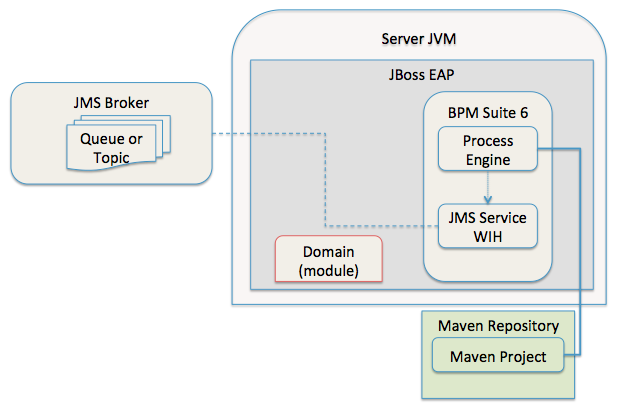
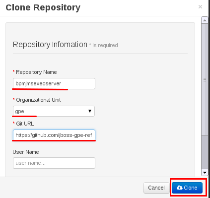

:data-uri:
:toc2:
:rpms: link:https://github.com/jboss-gpe-ose/jboss_bpm_soa_rpmbuild[RPMs]
:cart: link:https://github.com/jboss-gpe-ose/openshift-origin-cartridge-bpms-full[Red Hat GPE's BPM Suite 6 cartridge]
:bpmproduct: link:https://access.redhat.com/site/documentation/en-US/Red_Hat_JBoss_BPM_Suite/[Red Hat's BPM Suite 6 product]
:osetools: link:https://access.redhat.com/site/documentation/en-US/OpenShift_Enterprise/2/html-single/Client_Tools_Installation_Guide/index.html[Openshift Enterprise client tools]
:commands: link:https://access.redhat.com/site/documentation/en-US/Red_Hat_JBoss_BPM_Suite/6.0/html-single/Development_Guide/index.html#Execute_calls[BPM Suite 6 Commands]
:maven: link:https://access.redhat.com/site/documentation/en-US/Red_Hat_JBoss_BPM_Suite/6.0/html-single/Development_Guide/index.html#sect-Learn_about_Maven[Learn about Maven]

image::images/rhheader.png[width=900]

:numbered!:
[abstract]
== BPM Suite 6 Execution Server:  JMS API
This reference architecture provides a detailed example of how to configure and use the JMS API of the BPM Suite 6 Execution Server.
Along with the explanation, a project is provided with instructions on how to execute the example.

This reference architecture provides two major use cases related to JMS and BPM Suite 6 and one utility use case.  The two major use case are as follows:

. `JMS Transport` - Starting a BPM Suite 6 process via a JMS transport.  The use case includes passing parameters to the BPM Suite 6 process and receiving a confirmation response from BPM Suite 6.
. `JMS Service Task` - Sending a JMS message from a BPM Suite 6 process.

The utility use case uses JMeter to perform load tests against the JMS transport.  
The term `utility use case` is used because it is not functionality that is to be used in an application.

The following discusses when it is necessary to use these use cases, how the examples work, and how to configure the examples to run on your own system.

TIP: Within the context of the discussion, `TIP` sections like this will be used to highlight best practices.

:numbered:

== BPM Suite 6 integration via JMS
Message queues are a vital component to many application architectures.  Any time two independent systems are required to communicate, there is the high potential
that they will differ in processing speed and availability.  This leads to the need for asynchronous communication to decouple the sender from the receiver.  This decoupling
has numerous benefits to the overall system including:

. *Decoupling* - The two systems can be extended and modified independently as long as they adhere to the same interface requirements.  The JMS API provides
a well-known interface allowing for significant flexibility for how the two connected systems may be managed.
. *Redundancy* - The message may be held safely in the queue until the receiver is able to process the message without errors.  The queue safely holds onto
the request in the message until the the process explicitly indicates that the message has been received and processed.
. *Scalability* - Scaling with JMS is straight-forward.  If messages are being processed too slowly, simply add more processes to receive and process the messages.
. *Resiliency* - If the message receiving process fails, crashes, or is just down for maintenance, the decoupling provided by the JMS interface allows the message
producer to continue, unharmed by the the issues on consumer.
. *Delivery Guarantees* - The redundancy provided by JMS means that message delivery is guaranteed.  In many cases, queues are configured to be durable; their state
is even guaranteed to survive a server crash on the JMS broker, because messages are saved to a storage device.
. *Ordering Guarantees* - Various options are available for controlling the ordering of messages received from a queue, however the most common configuration is to provide
the messages in FIFO order (First In, First Out).
. *Buffering* - BPM is particularly well-suited for handling long-running business processes.  While a message producer may produce many messages in a day, a long-running business
process may have numerous wait-states and thus could take days to process.  It is critical that messages from producer systems are queued for processing when
consumer processing resources become available.

The JMS API can be used in two directions with respect to BPM Suite 6. First a JMS message may be sent to the BPM Suite 6 server to start a process.  Second
a BPM Suite 6 process may need to send a JMS message to a topic or queue.  Both of these cases are are addressed in this reference architecture.

== The JMS Transport
The JMS transport example sends a POJO java object from a client application to a BPM Suite 6 process.  The BPM Suite 6 process is started upon retrieving the message from the JMS queue.  
For this example, a `client application` refers to process running outside of the JVM for the server.  
See the following diagram for an illustration of this use case.

The following architecture diagram illustrates the components discussed below.

.JMS Transport Architecture Diagram
image::images/jms_transport_arch_diagram.png[width="60%"]

Each component in the diagram plays a role in the execution of the use case and is discussed roughly in the order of execution of the use case.

=== Client JVM
The client JVM typically runs on separate hardware from the server JVM.

=== JMS Client
The JMS client has access to the domain classes as dependencies. 
System properties for the client are read from the the pom.xml file associated with the client's project.
In addition the client has dependencies on the HornetQ client libraries for making connections with the HornetQ broker.

=== pom.xml
The pom.xml file contains a plugin for JMeter allowing the JMeter tests to be run by issuing a Maven build command of `mvn clean verify`.
The pom.xml file also contains the values for numerous properties used by the client.

=== Domain
The domain is a library of POJO objects that define the business objects used by the use case.  In this case the domain classes are `Driver` and `Policy`.
The domain library must be made available to the client, as a standard Maven dependency.  It is also made available to the server as a static module.

=== HornetQ
HornetQ is the default JMS broker available on JBoss EAP.  For this reference architecture, four queues are defined in HornetQ.  
These will be view-able via the JBoss EAP console as described below.

=== Maven Repository
Apache Maven is a distributed build automation tool used in Java application development to create, manage, and build software projects. Maven uses standard configuration files called Project Object Model, or POM, files to define projects and manage the build process. POMs describe the module and component dependencies, build order, and targets for the resulting project packaging and output using an XML file. This ensures that the project is built in a correct and uniform manner. For more information on Maven see {maven}.

=== Execution Server
The Execution Server exposes BPM Suite 6 functionality as a service.  Clients can interact with the BPM Suite 6 execution server via either REST or JMS.
For this reference architecture the Execution Server is the component that enables access to the process engine via JMS. 

=== BPM Suite 6 Process Engine

==  JMS Service Task
The purpose of this custom Work Item Handler is to provide a flexible JMS Service for sending messages via JMS to a JMS Queue or Topic, from a business process.

The following architecture diagram illustrates the components required for the JMS Service Task.

.JMS Service Task Architecture Diagram

Many of the components here have already been discussed in the previous section.  The additional components required by the JMS service task are discussed below.

=== JMS Service WIH
When a process instance is created that contains a JMS Service Task, the process engine will create an instance of the work item handler assigned to that service task.
In this case that class is the JMSWorkItemHandler(WIH). This class is deployed as part of the Kmodule deployment as discussed below.

=== JMS Broker
The JMS service does an JNDI look-up to find the JMS broker for sending messages.  In the case of this reference architecture, that JMS broker is the HornetQ JMS broker 
that comes bundled with JBoss EAP 6.  As discussed below, this may be reconfigured to point to the JMS broker of your choice.

== Pre-Requisites
The remainder of this documentation provides instructions for installation, configuration and execution of this reference architecture.  
The following is a list of pre-requisites:

. {osetools}
. Openshift Enterprise 2.* environment that has been installed with {rpms} needed to support {cart}.  Contact the Red Hat GPE team for more details.
. medium-sized Openshift Enterprise gear provisioned with {cart} and mysql-5.
. ssh client
. maven 3.0.5 (or greater)
. git client
. familiarity with {bpmproduct}
. proficiency with basic *nix command line
. proficiency with vi

As is evidenced by these pre-requisites, the assumed BPM Suite 6 run-time environment for this reference architecture 
documentation is an Openshift Enterprise gear.  However, BPM Suite 6 can be installed in a non-PaaS local environment.  
Thus it could be possible to execute this reference architecture in a non-PaaS local environment as well.

== Configuration and Execution
The following major steps are required to setup this use case.  The sections to follow will review these steps in detail.

.Setup Summary
. Clone this reference architecture
. Domain class installation
. Understand BPM Suite 6 message queues
. Configure port forwarding for the JMS Broker
. Add the target business process to the server
. Add the _JmsServiceQueue_
. Configure the JMS Client
. Execute the use case

The details of these steps are provided below.

=== Clone this reference architecture in local environment
This reference architecture will be cloned both in your local computer as well as in your remote BPM Suite 6 Openshift environment.  
To clone this reference architecture in your local environment, execute the following:  

-----
git clone https://github.com/jboss-gpe-ref-archs/bpm_jms_exec_server.git
-----

Doing so will create a directory in your local computer called:  _bpm_jms_exec_server_.  
For the purposes of the remainder of this reference architecture, this directory will be referred to as _$REF_ARCH_HOME_.

=== Domain class installation
In $REF_ARCH_HOME, there is a directory called `domain`.  
This directory contains a maven project for building and packaging the jar files that will contain the domain classes for this reference architecture.  
If you examine the domain classes, you will find that they are configured to enable serialization via Java Architecture for XML Binding (JAXB).  
There are steps required by the client to enable the server to process the JAXB annotated objects.
Those details are discussed in the <<Configure_the_JMS_Client,client configuration>> section. 

The following steps are directions for building the jar file and installing the jar as a static module on your EAP server running in OpenShift.
The `business-central.war` application in BPM Suite 6 will also be configured to have a dependency on the static module, making the domain class available to use in your business processes.

From your local cloned copy of this reference architecture execute the following:

. create the jar for the domain classes
.. `cd $REF_ARCH_HOME`
.. `mvn clean install`
. copy the directories and files required to create a static module on the JBoss EAP server
.. `scp -r domain/conf/org <your_openshift_url>:~/app-root/data/appModules/`
.. `scp domain/target/domain-1.0.jar <your_openshift_url>:~/app-root/data/appModules/org/acme/insurance/main`
. Add an explicit dependency for business-central.war on the static module for the domain module
.. `ssh <your_openshift_url>`
.. Open the following file using vi:  `~/bpms/standalone/deployments/business-central.war/WEB-INF/jboss-deployment-structure.xml`
.. Add the following to the list of dependencies: 

-----
<module name="org.acme.insurance" export="true" services="import" meta-inf="import"/>
-----

[start=4]
. Save the changes to the file
. Restart your OpenShift BPM Suite 6 instance
.. Determine if the JBoss process is already running by entering: `ps -aef | grep java`
... If the JBoss process is not running, then execute: `ctl_app start`
... If the JBoss process is running, then execute: `ctl_app restart` and select option `1` at the following prompt:

----------
Cart to restart?
1. bpms-6.0
2. mysql-5.1
----------

When the cursor returns, typically the server has not completely started at that moment.  Use the following command to view the log file and confirm
when the server start-up has completed:

.View the server log
----------
tail -f ~/bpms/standalone/log/server.log
----------

Wait for a log entry that includes the following:

.Confirmation of server start-up
----------
Deployed "business-central.war" (run-time-name : "business-central.war")
----------

Alternatively, you may get the following message:

.Start up confirmation message 2
----------
Replaced deployment "business-central.war" with deployment "business-central.war"
----------

=== Understand BPM Suite 6 Message Queues
When the business-central Workbench is deployed, the embedded _Execution Server_ begins to listen on the following queues already configured in the Hornetq subsystem:

* jms/queue/KIE.SESSION
* jms/queue/KIE.TASK
* jms/queue/KIE.RESPONSE

The `KIE.SESSION` and `KIE.TASK` queues should be used to send command request messages to the JMS API. 
Command response messages will be then placed on the `KIE.RESPONSE` queue. 
Command request messages that involve starting and managing business processes should be sent to the `KIE.SESSION` and command request messages that involve managing human tasks, should be sent to the `KIE.TASK` queue.

Messages sent to the two different input queues, `KIE.SESSION` and `KIE.TASK`, will be processed in the same manner regardless of which queue they are sent to.  The reason that two input queues are provided (rather than just one) is to allow for messages to be prioritized with more control.  
For example, in some use-cases, clients may send many more requests involving human tasks than requests involving business processes.  
If the business-process related messages are sent to `KIE.SESSION` and the human-task related messages are sent to `KIE.TASK`, then processing of business-process related messages occurs independent of processing of human-task related messages.

The BPM Suite 6 Execution Server uses a Message Driven Bean (MDB) to process messages from the queues.  
To change any of the above queues to an alternative queue, change the JNDI name in the MDB configuration to point to the desired queue.  
The JNDI configuration for the MDB can be found at the following location:

.ejb-jar.xml file for the MDB
----------
$JBOSS_HOME/standalone/deployments/business-central.war/WEB-INF/ejb-jar.xml
----------

In your remote Openshift environment provisioned with BPM Suite 6, the three business-central queues are already created in the default messaging subsystem: HornetQ. 
To view them, open your browser to the JBoss EAP management console `(http://<your_openshift_host>/console/App.html)` of your remote Openshift environment and navigate to:  Profile -> Subsystems -> Messaging -> Destinations -> default -> View .  
The following should appear:

Also, enabled by default in your remote Openshift environment is the messaging configuration: _message-counter-enabled_.  
This will prove useful later when executing the included load test to easily visualize real-time messaging statistics per queue.  
The overhead of enabling messaging statistics in HornetQ is negligible.

By default, authentication to the Hornetq messaging subsystem is enabled in JBoss EAP 6.  
Also, authorization rules are set to restrict only authenticated users with a role of _admin_ the ability to send messages to the BPM Suite 6 queues.  
These messaging security settings can be seen by navigating to the following the JBoss EAP management console of your Openshift environment:  Profile -> Subsystems -> Messaging -> Destinations -> default -> Security Settings.

The remote Openshift environment provisioned with JBoss EAP and BPM Suite 6 has already been pre-configured to allow for the _jboss_ user to send messages to the BPM Suite 6 queues.  
Therefore, your JMS clients sending process-instance and human task related messages to the BPM Suite 6 JMS API should do so as the 'jboss' user. 

HornetQ uses port `5445` which is not an open port on the OpenShift server.
Therefore port forwarding is configured in the next step to expose this port to remote JMS clients.

[[HornetQ_port_forwarding]]
=== Configure port forwarding for the JMS Broker
The ssh utility allows you to forward a port through the encrypted connection it establishes.  
This setup is also referred to as `ssh tunneling`.
Since port 5445 is not open on the OpenShift server, port forwarding will be configured to securely access these services.

Execute the following commands from your command window on your local computer to configure and launch a port forwarding process for access to HornetQ:

.Obtain the IP address for the OSE internal NIC
----------
ssh <ssh_url_to_your_openshift_environment> 'echo $OPENSHIFT_BPMS_IP'
----------

.Port Forwarding command for HornetQ access
----------
ssh -N -L localhost:5445:<ipaddress from previous step>:5445 <ssh_url_to_your_openshift_environment>
----------

While the port forwarding process is running, the HornetQ broker can be accessed on the local computer at `localhost:5445`.
Use `Ctrl+c` to kill port forwarding.

=== Clone this reference architecture in BPM Suite 6
This reference architecture uses a simple business process that includes a _Service Task_ that places a message on a JMS business queue.

Use the following steps to clone this reference architecture in BPM Suite 6:

. Create an *Organization and clone this project's git repository in your BPM Suite 6 server
.. Select `Authoring` -> `Administration`
.. Select `Organizational Units` -> `Manage Organizational Units`
.. Under `Organizational Unit Manager`, select the `Add` button
.. Enter a name of _gpe_ and an owner of _jboss_. Click `Ok`
. Clone this bpm_jms_exec_server repository in BPM Suite 6
.. Select `Repositories` -> `Clone Repository` .  Populate the _Clone Repository_ box as follows and then click _Clone_ :

Enter _bpmjmsexecserver_ as the value of the _repository name_.  The _Git URL_ is the URL to this git project in github:  

-----
https://github.com/jboss-gpe-ref-archs/bpm_jms_exec_server.git 
-----

Once successfully cloned, BPM Suite 6 will pop-up a new dialog box with the message:  _The repository is cloned successfully_

[start=2]
. Open a command window to your previously cloned $REF_ARCH_HOME/bpm_jms_exec_server directory.
. Add to this git project a remote reference to the corresponding _bpmjmsexecserver_ repository in your Openshift environment

----------
git remote add oserepo ssh://<your.openshift.ssh.url>/~/app-root/data/bpmsGit/.niogit/bpmjmsexecserver.git
----------

[start=4]
. in your local $REF_ARCH_HOME/bpms_jms_exec_server directory, execute:  _git pull oserepo master_ .  
Doing so will sync your local repo with your remote Openshift repo.

=== Review and deploy the *processTier* project
. View the _processTier_ project in your BPM Suite 6 server
.. Select `Authoring` -> `Project Authoring`
.. Make sure the `processTier` repository is view-able in the `Project Explorer`
... Toggle the view using the wheel icon  if needed.
. From within the business-central workbench, select `Authoring` -> `Project Authoring`
. Find and open the `bpm_jms_exec_server` BPMN2 business process in the Web Designer
. Open the `Properties` panel for the process and notice the process Id value of `processTier.bpm_jms_exec_server`. This will be used in the client's JMS message.

Use the following steps to create a deployment for the project:

[start=9]
. From within the business-central workbench, select `Tools` -> `Project Editor`
. Select the `Build & Deploy` button.
. After the build completes, select `Deploy` -> `Deployments`
. Take note of the deployment Id in the column labeled `Deployment`.
If you used the values in this document, then the deployment ID will be: `com.redhat.gpe.refarch.bpm_jms_exec_server:processTier:1.0`.  This value will be used in the client's JMS message.

=== Add the _JmsServiceQueue_
The *bpm_jms_exec_server* business process definition defines a custom Service Task whose corresponding custom workItemHandler will send a message to a business queue in the co-located Hornetq sub-system.  
This business queue (called _JmsServiceQueue_ ) needs to be created in the Hornetq subsystem.  
To create this queue, open the JBoss EAP Management Console to your remote Openshift environment and navigate to:  Profile -> Subsystems -> Messaging -> Destinations -> default -> View -> Queues/Topics -> Add .  
Populate the dialog box as follows:

[[Configure_the_JMS_Client]]
=== Configure the JMS Client
The JMS Client is located in the *$REF_ARCH_HOME/loadTest* directory of this reference architecture.  
It is a java class that builds an instance of the _Policy_ domain object and sends the object in a JMS Message to the BPM Suite 6 server to start a business process.  
The name of the class is *com.redhat.gpe.refarch.bpm_jms_exec_server.loadtest.JMSClient*.  
Note that this class also extends the JMeter AbstractJavaSamplerClient class.
Use of JMeter with this reference architecture will be discussed in the next section of this documentation.

This document will not cover aspects of this client that are common to sending JMS messages.
However, there are a few important details in the client that are specific to this use case that require further explanation.
These details are discussed in the following sections.
Open the client class in an editor to view the details along with this discussion.

==== JAXB deserialization
The client class uses JAXB to serialize the POJOs before sending them via JMS.  The following is required by the client to provide the JAXB context required for serializing
the POJO on the client side:

.Providing the JAXB context on the client
----------
/* -------  Required for proper serialization on the Client side (for the JAXB context) ------- */
jaxbSerializationProvider.addJaxbClasses(Policy.class);
----------

On the server side, these objects must be deserialized via JAXB.  For this to occur
the server must know the type of the object contained within the message.  To provide this information on the server, a special string property is is added to the
JMS message by the following code.
 
The following code snipped is from the `sendJMSJaxCommandsRequest` method of the class:

.Providing Context for JAXB Deserialization
----------
/* ----- Required for deserialization on the server ---------- */
Set<Class<?>> extraJaxbClasses = new HashSet<Class<?>>();
extraJaxbClasses.add(Policy.class);
String extraJaxbClassesPropertyValue = JaxbSerializationProvider.classSetToCommaSeperatedString(extraJaxbClasses);
msg.setStringProperty(EXTRA_JAXB_CLASSES_PROPERTY_NAME, extraJaxbClassesPropertyValue);
----------

In this code snipped, *Policy.class* is the class for the POJO object called Policy.  If additional classes were required, then simply add more calls to 
the `extraJaxbClasses.add` method.  

==== Provide the target for the message
Once the object has been deserialized on the server, the Execution Server must know which deployment is the target of the message.  For this information,
another string property is set on the JMS message as shown in the follow code snippet:

.Providing the DeploymentID
----------
/* ------- Required for the server to locate the target deployment for the process --------- */
msg.setStringProperty(DEPLOYMENT_ID_PROPERTY_NAME, deploymentId);
----------

The value for `deploymentId` is provided as a property in the *$REF_ARCH_HOME/loadtest/pom.xml* file, and initialized in the constructor for this class.

==== BPM Suite 6 command objects
The client use a BPM Suite 6 command objects to provides a programmatic interface to the JMS API and take care of the underlying details of sending and receiving commands via JMS.
The following code of the client is used to create the command object for starting a process in BPM Suite 6:

.StartProcess Command object
----------
// create the start process command object
StartProcessCommand cmd = new StartProcessCommand(processId); <1>
        
// populate domain model classes
Policy policyObj = populatePolicyObject();
cmd.putParameter(POLICY, policyObj);  <2>
        
// send the start process command
JaxbCommandsRequest req = new JaxbCommandsRequest(deploymentId, cmd); <3>
----------
<1> The *StartProcessCommand* object is created.  The `processId` of the target process is provided as parameter to the command.
<2> The call to *putParameter* on the command object is used to provide the payload.
<3> The StartProcessCommand object is then sent as parameter to the *JaxbCommandRequest* wrapper object.

The StartProcessCommand object is only one of may commands that can be processed by the execution server.  For a complete list of available commands
see {commands}.

=== Execute the use case
Before executing the test, open the *loadtest/pom.xml* file and configure the parameters to suite your server.  In particular be sure that the following properties are correct for your environment:

* process.id
* deploymentId
* hornetq.host
* hornetq.user
* hornetq.password

To execute the process do the following:

. Open a command window and ssh into your server instance.
. Execute `tail -f ~/bpms/standalone/log/server.log` to watch the server log entry during the test
. If it is not already running, open a command window and run port forwarding for HornetQ as described in <<HornetQ_port_forwarding,Configure port forwarding for the JMS Broker>>.
. Open a command window to the $REF_ARCH_HOME/loadTest directory and execute:  `mvn clean verify`

=== View results
* The server.log of your remote BPM Suite 6 enabled Openshift Environment should include statements similar to the following:

-------
[com.redhat.gpe.refarch.bpm_jms_exec_server.processTier.JMSWorkItemHandler]  Sending messageContent: Driver  properties =
    driverName : alex
    dlNumber : 7
    age : 21
    # accidents : 0
    # tickets : 1
    SSN : 555-55-555
    # creditScore : 800
-------

* Also, in the JBoss EAP Management Console, navigate to Runtime -> JMS Destinations -> JmsServiceQueue, and  notice that JMS messages have begun to accumulate in the previously configured _JmsServiceQueue_ :

== JMS Service Task use and configuration
The configuration of the Service Task has already been completed.  However, the following is important to understand concerning how to add custom work item handlers in BPM Suite 6.

=== Adding the registration for the WIH
To register the Work Item Handler it must be registered with the process engine.  This is done via the project kmodule.xml as follows:

. Within Business-central navigate to the `kmodule.xml` file. (under resources/META-INF)
. Notice the following has already been added:

----------
<kmodule xmlns="http://jboss.org/kie/6.0.0/kmodule" xmlns:xsi="http://www.w3.org/2001/XMLSchema-instance">
  <kbase name="policyQuoteKBase" default="true" eventProcessingMode="stream" equalsBehavior="equality" declarativeAgenda="disabled" scope="javax.enterprise.context.ApplicationScoped" packages="*">
    <ksession name="policyQuoteKSession" type="stateful" default="true" clockType="realtime" scope="javax.enterprise.context.ApplicationScoped">
      <workItemHandlers>
        <workItemHandler type="new org.gpe.service.jms.JMSWorkItemHandler()" name="JMSServiceTask"/>
      </workItemHandlers>
    </ksession>
  </kbase>
</kmodule>
----------

=== Adding the WIH to the class-path
Also within Business-central, navigate the project folders to `com.redhat.gpe.refarch.bpm_jms_exec_server.processTier`.  Click on `Java Source Files` in the project assets pain.
There you will find the `JMSWorkItemHandler` implementation file.  This work item implementation file is included in the kjar deployment.  As of version 6.0.1 of BPM Suite 6, this
file must be included in the kjar.  It will not be found if added as a static module.

== Performance Testing
In the following we measure the system impact when changes are made to configuration parameters on the JMS interface between BPM Suite 6 and 
JMS client applications.  Other relevant BPM Suite 6 configuration options are also taken into consideration.
* Queue sizing
* message listener configuration
* durable vs non-durable queues
* Single process knowledge session vs process per request
